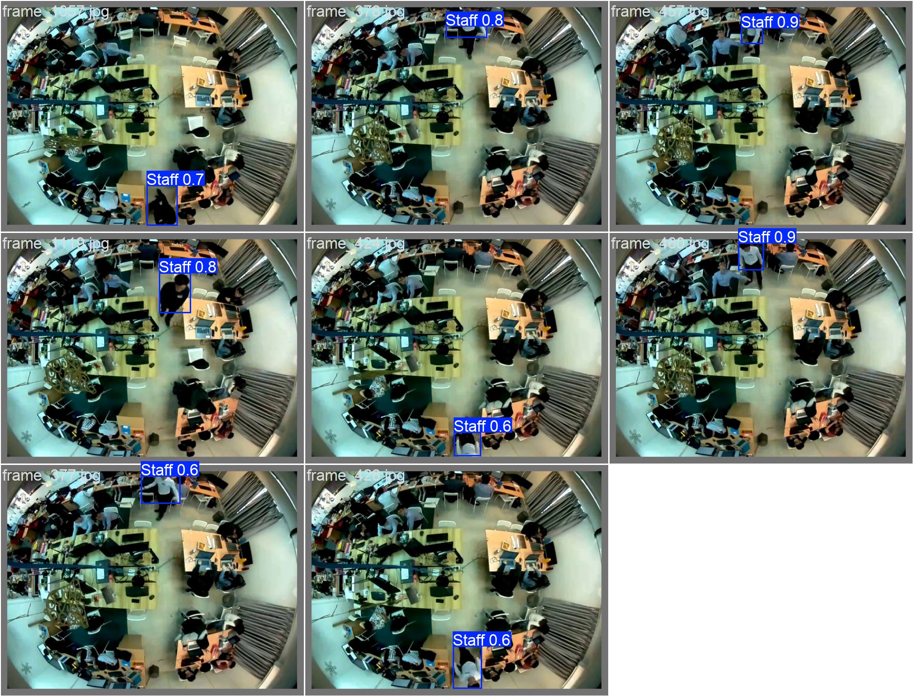

# Staff Detection Application Documentation

---

## Table of Contents
1. Introduction

2. Features

3. Requirements

4. Setup and Installation
    - Model Placement
    - Run the Application

5. How to Use
    - Application Layout
    - Step-by-Step Usage
    - Load a Video
    - Start Detection
    - Stop Detection

6. Fine-tune Process Explanation
    - Prepare a Custom Dataset
    - Create a Configuration File
    - Fine-tune YOLOv8

7. Staff Detection Results
---

### 1. Introduction

The Staff Detection application is a **graphical user interface (GUI) tool** built with **PyQt5** designed to identify staff members within video files. It leverages a pre-trained **YOLOv8 object detection model** to provide real-time detection, visualizing results directly on the video feed, and saving the annotated video for later review.


---

### 2. Features

* **Load Video:** Easily select and load MP4 video files for analysis.

* **Real-time Detection:** Process video frames live, performing immediate object detection.

* **YOLOv8 Integration:** Utilizes a **custom-trained YOLOv8 model** for accurate staff identification.

* **Visual Feedback:** Displays **bounding boxes**, **confidence scores**, and **class labels** around detected staff members.

* **Output Video Saving:** Automatically saves the processed video, complete with all detections, to a new MP4 file.

* **Dark Mode:** Features a built-in dark theme for a comfortable user experience.

* **Status Bar:** Provides clear, real-time updates on the application's status.

---

### 3. Requirements

To run this application, ensure you have the following Python libraries installed:

* `opencv-python`

* `ultralytics`

* `PyQt5`

You can install them quickly using pip:
```
pip install opencv-python ultralytics PyQt5
```

---

### 4. Setup and Installation

1. **Model Placement:** Verify that your **trained YOLOv8 model** (`staff_detection\train2\weights\best.pt`) is located at the path specified by the `MODEL_PATH` variable in the script. By default, this is set to `staff_detection\train2\weights\best.pt`. Adjust this path if your model file is stored elsewhere.

3. **Run the Application:** Open a terminal or command prompt, navigate to the directory containing the script, and execute:
    ```
    python <ur root path>/code/ui.py
    ```

---

### 5. How to Use

#### 5.1. Application Layout

The application's main window is straightforward:

* The **video display area** on the left shows the video input and detection results.

* A **button panel** on the right contains controls for video loading and detection management.

* A **status bar** at the bottom provides informative messages and feedback.

#### 5.2. Step-by-Step Usage

1. **Load a Video:**

* Click the **"Load Video"** button.

* A file dialog will appear. Browse to your desired MP4 video file and select it.

* Once loaded, the first frame of the video will display, and the status bar will confirm the selected file. The **"Start Detection"** button will become active.

2. **Start Detection:**

* Click the **"Start Detection"** button.

* The application will begin processing the video frame by frame, performing staff detection.

* Detected staff will be highlighted with bounding boxes and labels. The coordinates of the highest confidence detection will also be displayed on the video feed.

* A new MP4 file, named like `output_YYYYMMDD_HHMMSS.mp4`, will be saved in the same directory, containing the processed video with detections.

* The status bar will indicate that detection has started, and the **"Stop Detection"** button will become active.

3. **Stop Detection:**

* Click the **"Stop Detection"** button at any time to pause the detection process.

* The video processing will cease, the status bar will confirm the stop, and the output video file will be finalized up to that point. The **"Start Detection"** button will reactivate, allowing you to restart if needed.

---

### 6. Fine-tune Process Explanation
The provided application uses a custom-trained YOLOv8 model (best.pt). The process involves a few key steps:

#### i. Prepare a Custom Dataset:
- Use `code\data_preparation\frame_extract.py` to extract frames from `sample.mp4`, extracted frame images will be saved in `./img`.
- Annotate extracted frames with label-studio (https://github.com/HumanSignal/label-studio). After annotation, save labels of annotated frames to `./dataset`.
- Use `code\data_preparation\split.py` to split those labels into 80% of train labels and 20 % of validation labels.
- Use `code\data_preparation\get_img.py` to get corresponding frame image in `./img` by the labels file name.

#### ii. Create a Configuration File:
Create a .yaml file to define your dataset. This file specifies the paths to your training and validation images, the number of classes (nc), and the names of the classes (names). The structure looks like:
```
path: <root path of ur dataset>
train: images/train
val: images/val
nc: 1
names: ["Staff"]
```

#### iii. Fine-tune YOLOv8:
Run the script in `./code/fine_tune.py` to fine tune YOLOv8. After fine tuned a `./staff_detection` folder will be created. Upon completion, a ./staff_detection folder will be generated, containing the optimized model and associated performance metrics."

---

### 7. Staff Detection Results
Here are some sample outputs from the staff detection model:



